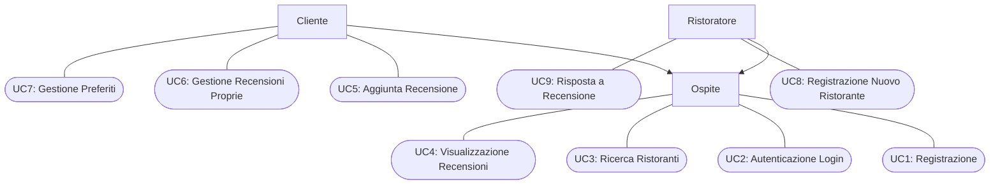
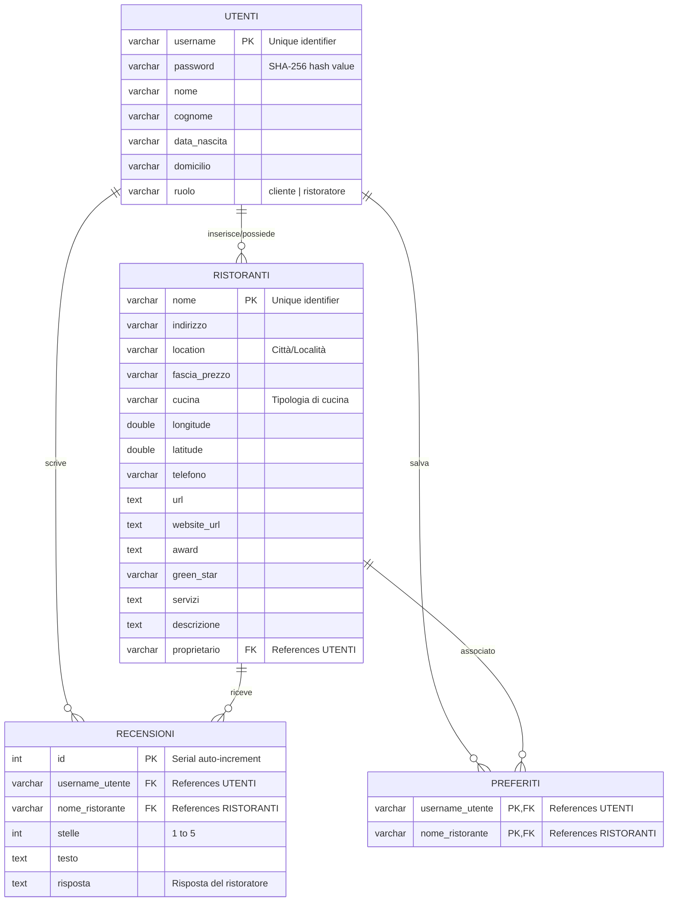
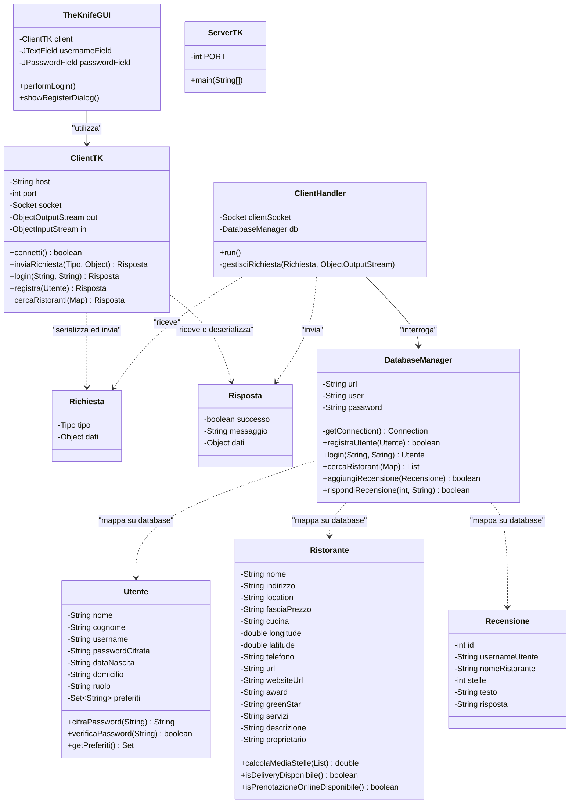
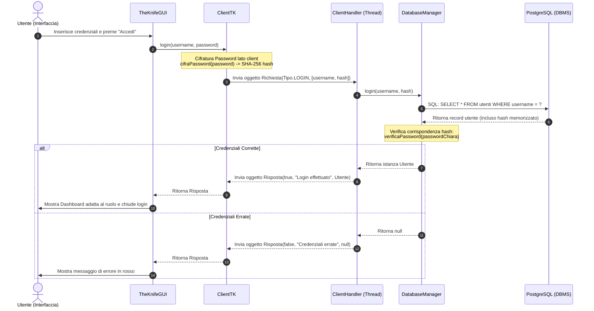

# Manuale Tecnico: The Knife

**Autori del Progetto:**
* **Mattia Polato** (Matricola: 757923 - Sede: Varese)
* **Andrea Luigi Mariani** (Matricola: 757369 - Sede: Varese)

---

## 1. Analisi dei Requisiti

**The Knife** è un'applicazione client-server in linguaggio Java progettata per facilitare la ricerca, recensione e gestione di ristoranti. La piattaforma si rivolge a tre principali categorie di utenti (Attori):

1. **Ospite (Non autenticato)**: Può effettuare ricerche generali dei ristoranti e consultare le recensioni lasciate dagli altri utenti.
2. **Cliente (Autenticato)**: Oltre alle funzionalità dell'ospite, può aggiungere ristoranti alla propria lista dei preferiti, pubblicare recensioni (valutazione in stelle e commento testuale), e modificare o cancellare le proprie recensioni.
3. **Ristoratore (Autenticato)**: Può inserire nuovi ristoranti di sua proprietà all'interno del sistema e rispondere ufficialmente alle recensioni pubblicate dai clienti per i suoi ristoranti.

### Diagramma dei Casi d'Uso (UML)

Il seguente diagramma descrive graficamente le interazioni tra gli attori e i casi d'uso principali del sistema:



### Requisiti Non Funzionali
* **Sicurezza**: Le password degli utenti non vengono salvate in chiaro. La cifratura avviene lato client tramite l'algoritmo di hash a una via **SHA-256** prima di essere trasmesse in rete e archiviate nel database.
* **Concorrenza**: Il server deve essere in grado di servire contemporaneamente molteplici client connessi, allocando un thread di esecuzione indipendente per ogni connessione socket attiva.
* **Persistenza**: Tutti i dati relativi a utenti, ristoranti, recensioni e preferiti devono essere salvati in modo permanente su una base di dati relazionale **PostgreSQL**.

---

## 2. Progettazione della Base di Dati (Modello ER)

Il database di **The Knife** è progettato per garantire l'integrità referenziale dei dati. La struttura logica prevede quattro relazioni principali: `utenti`, `ristoranti`, `recensioni` e `preferiti`.

### Diagramma Entità-Relazione (ER)



### Schema Relazionale (DDL SQL)
Il database è implementato in PostgreSQL tramite lo script [schema.sql](schema.sql), con i seguenti vincoli di integrità:
* **Chiavi Primarie (PK)** e **Chiavi Esterne (FK)** per garantire la coerenza tra le entità.
* Vincolo `CHECK (ruolo IN ('cliente', 'ristoratore'))` sulla tabella `utenti`.
* Vincolo `CHECK (stelle >= 1 AND stelle <= 5)` sulla tabella `recensioni` per limitare il punteggio delle valutazioni.
* Chiave primaria composta `PRIMARY KEY (username_utente, nome_ristorante)` sulla tabella di associazione `preferiti` per impedire duplicazioni dello stesso ristorante nei preferiti di un singolo utente.

---

## 3. Progettazione Architetturale e Design Patterns

L'applicazione segue un'architettura **Client-Server distribuita a tre livelli (Three-Tier)**:
1. **Presentation Layer (Client GUI)**: Realizzato in Java Swing, fornisce un'interfaccia intuitiva e reattiva all'utente finale.
2. **Application Logic Layer (Server & Sockets)**: Il server gestisce le richieste dei client tramite Socket TCP, elaborandole in modo asincrono.
3. **Data Layer (PostgreSQL Database)**: Gestisce la persistenza strutturata accessibile tramite protocollo JDBC.

```
+--------------------------+                  +---------------------------+                  +---------------------+
|        CLIENT-SIDE       |                  |        SERVER-SIDE        |                  |      DATABASE       |
|  +--------------------+  |  Request (TCP)   |  +---------------------+  |    JDBC Queries  |  +---------------+  |
|  |  Swing GUI Views   |====================>|  | ClientHandler (T)   |====================>|  |  PostgreSQL   |  |
|  +--------------------+  |                  |  +---------------------+  |                  |  +---------------+  |
|            ||            |                  |            ||             |                  |                     |
|  +--------------------+  |  Response (TCP)  |  +---------------------+  |                  |                     |
|  |      ClientTK      |<====================|  |   DatabaseManager   |  |                  |                     |
|  +--------------------+  |                  |  +---------------------+  |                  |                     |
+--------------------------+                  +---------------------------+                  +---------------------+
```

### Design Patterns Applicati

1. **Model-View-Controller (MVC) concettuale**:
   * **Model**: Rappresentato dalle classi POJO serializzabili nel package `theknife.common` ([Utente.java](src/main/java/theknife/common/Utente.java), [Ristorante.java](src/main/java/theknife/common/Ristorante.java), [Recensione.java](src/main/java/theknife/common/Recensione.java)).
   * **View**: Composta dalle classi grafiche Swing del package `theknife.client` ([TheKnifeGUI.java](src/main/java/theknife/client/TheKnifeGUI.java), [ClientDashboard.java](src/main/java/theknife/client/ClientDashboard.java), [RestaurateurDashboard.java](src/main/java/theknife/client/RestaurateurDashboard.java)).
   * **Controller**: Implementato lato client da [ClientTK.java](src/main/java/theknife/client/ClientTK.java) (che invia i comandi di rete) e lato server da [ClientHandler.java](src/main/java/theknife/server/ClientHandler.java) (che riceve e instrada le richieste verso il database).

2. **Data Transfer Object (DTO)**:
   * Le classi [Richiesta.java](src/main/java/theknife/common/Richiesta.java) e [Risposta.java](src/main/java/theknife/common/Risposta.java) agiscono come contenitori di dati serializzati per standardizzare e isolare il protocollo di comunicazione di rete, evitando di esporre dettagli di basso livello della connessione socket alle viste.

3. **Active Object / Thread-per-Message (Gestione della concorrenza)**:
   * [ServerTK.java](src/main/java/theknife/server/ServerTK.java) delega ogni nuova connessione client a una nuova istanza di [ClientHandler.java](src/main/java/theknife/server/ClientHandler.java) eseguita all'interno di un thread indipendente (`new Thread(handler).start()`). Questo assicura che un'operazione lenta di un utente (es. una query pesante al database) non blocchi gli altri utenti connessi.

4. **Data Access Object (DAO) / Database Manager**:
   * La classe [DatabaseManager.java](src/main/java/theknife/server/DatabaseManager.java) centralizza l'accesso al database. Tutte le query SQL e l'apertura delle connessioni JDBC sono incapsulate al suo interno, nascondendo la complessità di SQL al resto dell'applicazione server.

---

## 4. Diagramma delle Classi UML

Il seguente diagramma descrive la struttura statica del software, evidenziando la divisione nei tre package principali: `client`, `common` e `server`.



---

## 5. Diagramma di Sequenza (UML)

Il diagramma di sequenza seguente illustra il flusso dinamico di una richiesta di **Login (Autenticazione)** effettuata da un utente tramite l'interfaccia grafica:



---

## 6. Dettagli Implementativi

### 6.1 Comunicazione di Rete (Sockets)
La comunicazione tra il client e il server è basata su **Socket TCP** persistenti. Per semplificare lo scambio di dati complessi ed evitare il parsing manuale di stringhe o formati di testo (come JSON o XML), l'applicazione fa uso della **Serializzazione nativa di Java**:
* Le classi `Richiesta`, `Risposta`, `Utente`, `Ristorante` e `Recensione` implementano l'interfaccia `java.io.Serializable`.
* I canali di comunicazione sono aperti mediante `ObjectOutputStream` e `ObjectInputStream`.
* All'avvio, il client effettua una connessione persistente che rimane aperta per tutta la durata della sessione.

### 6.2 Integrazione con PostgreSQL e JDBC
La persistenza dei dati è gestita da PostgreSQL. Per connettersi al database da Java, è stato utilizzato il driver JDBC ufficiale.
* All'avvio, l'applicazione Server richiede dinamicamente all'amministratore (tramite prompt interattivo da terminale) l'host del DB, lo username e la password, garantendo flessibilità di deployment senza salvare credenziali hard-coded nel sorgente.
* Tutte le operazioni di scrittura ed interrogazione utilizzano `PreparedStatement` per due motivi fondamentali:
  1. **Sicurezza**: Prevengono attacchi di **SQL Injection** effettuando automaticamente l'escaping dei parametri di input.
  2. **Performance**: Consentono al DBMS PostgreSQL di pre-compilare ed ottimizzare i piani di esecuzione delle query.
* Il ciclo di vita delle risorse JDBC (`Connection`, `PreparedStatement`, `ResultSet`) è rigorosamente gestito utilizzando il costrutto Java **try-with-resources**, garantendo la chiusura automatica delle risorse anche in caso di eccezioni SQL, prevenendo perdite di memoria (memory leaks) ed esaurimento delle connessioni al database.

### 6.3 Interfaccia Grafica (Swing)
L'interfaccia utente è interamente programmata in **Java Swing**:
* È stato configurato il Look and Feel **Nimbus** all'avvio dell'applicazione per garantire un aspetto moderno ed uniforme su tutti i sistemi operativi.
* L'applicazione adatta dinamicamente le viste a seconda del ruolo dell'utente loggato (`ruolo` in tabella `utenti`):
  * **Ospite**: Accede a [GuestDashboard.java](src/main/java/theknife/client/GuestDashboard.java) con diritti di sola consultazione e ricerca dei ristoranti.
  * **Cliente**: Accede a [ClientDashboard.java](src/main/java/theknife/client/ClientDashboard.java), abilitando la scrittura e gestione delle recensioni e la lista dei preferiti.
  * **Ristoratore**: Accede a [RestaurateurDashboard.java](src/main/java/theknife/client/RestaurateurDashboard.java), da cui può registrare nuovi locali e rispondere direttamente al feedback dei clienti.

---

## 7. Validazione e Controllo Qualità (Testing)

Per garantire la robustezza e la corretta integrazione dei componenti del sistema, sono stati definiti diversi scenari di test (disponibili nel package `theknife` all'interno della cartella `src/test/java`):

1. **Test del Modello Utente** ([TestUtente.java](src/test/java/theknife/TestUtente.java)):
   * Valida la corretta cifratura a una via delle password (algoritmo SHA-256).
   * Verifica l'autenticazione delle credenziali (esiti positivi/negativi).
   * Testa il corretto flusso di **serializzazione/deserializzazione** dell'oggetto `Utente` per garantirne l'integrità durante il trasferimento di rete.

2. **Test dei Filtri Database** ([TestDatabaseFiltri.java](src/test/java/theknife/TestDatabaseFiltri.java)):
   * Verifica le query di ricerca dei ristoranti sul database PostgreSQL.
   * Controlla il comportamento della ricerca case-insensitive e parziale (`ILIKE` in SQL).
   * Testa la combinazione di più filtri di ricerca (Località + Cucina).

3. **Test del Protocollo di Rete** ([TestComunicazione.java](src/test/java/theknife/TestComunicazione.java)):
   * Simula l'invio e la ricezione di pacchetti serializzati `Richiesta` e `Risposta` senza necessitare di una rete attiva, facendo uso di pipe di I/O in-memory (`PipedInputStream` e `PipedOutputStream`).

4. **Test di Integrazione Generale** ([TestIntegrazioneGenerale.java](src/test/java/theknife/TestIntegrazioneGenerale.java)):
   * Esegue un test end-to-end simulando l'avvio del server in un thread separato (configurato programmando input fittizi), la connessione reale del client via Sockets e l'esecuzione di una query sul database reale, validando l'intero ciclo di vita di una richiesta client-server.
